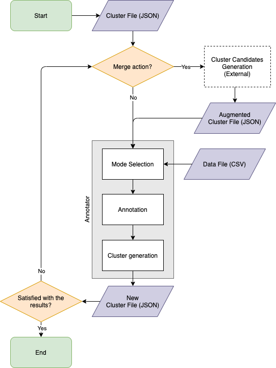

# Cluster Annotator

Cluster Annotator is a general-purpose tool for annotating clusters.


## Usage

- Installation:

```
git clone git@github.com:usc-isi-i2/cluster-annotator.git
cd cluster-annotator
pip install -r requirements.txt
```

- Configuration:

The configuration file needs to be prepared. A typical config file formats like this:

```
{
    "debug": true,
    "host": "localhost",
    "port": 9999,
    "logging_file": "data/log.log",
    "logging_level": "DEBUG",
    
    "data_file": "data/2015-2020 Evictions Maricopa County - 2020.csv",
    "data_columns": [
        "Case Number",
        "Plaintiff Name",
        "Plaintiff1 Address"
    ],
    "data_id_column": "Case Number",
    "cluster_name_column": "Plaintiff Name",
    "cluster_file_dir": "data",
    "status_file": "data/status.db",
    
    "max_num_of_records": 5
}
```

- Execution:

```
python starter.py --config config.json
```

By default, the annotator searches for `config.json` in the root of the directory if it is not specified.

## File format

Two files are required for running the annotator.

- *Cluster file* is a JSON file with the following format:

```
{
    "clusters": [
        {
            "id": "unique cluster id",
            "records": [
                "unique record id",
                ...
            ]
        },
        ...
    ],
    "similar_clusters": [
        [
            "cluster id",
            ...
        ],
        ...
    ]
}
```

> `similar_clusters` is only required in merge mode. This needs to be generated with external command or custom script.
> One record id can only appear in one cluster; one cluster id can only appear in one similar cluster.

- *Data file* is a CSV file. One of the columns indicates the record id.

## Workflow


